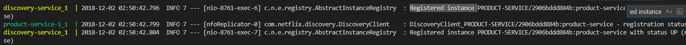
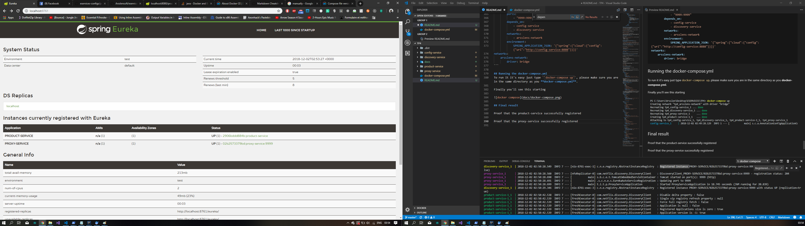

Dockerizing product microservices
=======
<!-- TOC -->autoauto- [Acknowledgement](#acknowledgement)auto- [Requirements](#requirements)auto- [Tip](#tip)auto- [Disclaimer](#disclaimer)auto- [Downloading Docker and starting the Docker engine](#downloading-docker-and-starting-the-docker-engine)auto    - [Checks](#checks)auto- [Microservices to deploy on Docker](#microservices-to-deploy-on-docker)auto- [Dockerising the Microservices](#dockerising-the-microservices)auto    - [Why not spotify docker maven plugin like previous generations?](#why-not-spotify-docker-maven-plugin-like-previous-generations)auto    - [Adding the plugin to pom.xml](#adding-the-plugin-to-pomxml)auto    - [Automating the build tasks](#automating-the-build-tasks)auto- [Creating a repository for the config files](#creating-a-repository-for-the-config-files)auto- [Changing some properties in the config repository](#changing-some-properties-in-the-config-repository)auto- [Building the images](#building-the-images)auto- [Writing the docker-compose.yml](#writing-the-docker-composeyml)auto    - [The config-service section](#the-config-service-section)auto    - [The product-service section](#the-product-service-section)auto    - [The discovery-service section](#the-discovery-service-section)auto    - [The proxy-service section](#the-proxy-service-section)auto    - [All in one file](#all-in-one-file)auto- [Running the docker-compose.yml](#running-the-docker-composeyml)auto- [Final result](#final-result)auto- [Conclusion](#conclusion)auto- [After party](#after-party)autoauto<!-- /TOC -->
## Acknowledgement

This work has been achieved with the collaboration of Mohamed Assil Ben Amor and Ismail Akrout, Saturday at GO MY CODE (eating a lot of snacks) and doing a lot of research and testing.

## Requirements
You need to install
- Intellij
- JDK 8 (Java 9 won't work)
- Spring... (TP dependencies)
## Tip
This work is our original footprint and made us learn lessons from the mistakes of previous generations in this homework.
## Disclaimer
A windows 10 OS is used for this application, but don't worry it's the same for all other OS (it's docker)
## Downloading Docker and starting the Docker engine
First go to https://docs.docker.com/install/ and download the docker community version (depending on your OS)
### Checks
- After installing docker engine please check that you've enabled TLS connection
- And make sure you're not signed on to the docker hub
- You should also run the docker engine

This is a screenshot of the settings


## Microservices to deploy on Docker
* Product Service: The main service, which offers a REST API listing all products.
* Config Service : Configuration service, whose role is to centralize the configuration files of the various microservices in a single place.
* Proxy Service: A gateway that handles the routing of a request to one of the instances of a service, in order to automatically manage the load distribution.
* Discovery Service: Service that records service instances for discovery by other services.

The resulting **architecture**:


## Dockerising the Microservices
To dockerize our microservices, we need to generate docker image from each Spring boot application using maven. This can be achieved by one of these methods:
- Create a Dockerfile manually for each micro-service
- Using io.fabric8 (docker-maven-plugin)

In this tutorial we will use the docker maven plugin, because we are going to automate the build tasks

### Why not spotify docker maven plugin like previous generations?
Because in order to successfully launch the micro-services you need to do it in this order:
- Build the config image
- Run the config image in a container
- Build the product image
- Build discovery and proxy images
- Run the product, discovery and proxy images

The problem that we can face, that none of the previous generation covered that actually to do that you need to run them in order manually, but no we believe in automation that's the **DevOps spirit**.

And in order to do that we need to run commands to check service status or just wait for some time then execute the jar file.

Even though we used the dependency tag in the docker-compose.yml you need to set a time gap.
### Adding the plugin to pom.xml
The first step, is to configure the config-service, so open pom.xml

```xml
<plugin>

				<groupId>io.fabric8</groupId>
				<artifactId>docker-maven-plugin</artifactId>
				<configuration>
					<images>
						<image>
							<alias>${project.artifactId}</alias>
							<name>${project.artifactId}</name>
							<build>
								<from>java:8</from>
								<entryPoint>
									<shell>["java", "-jar",  "/maven/${project.build.finalName}.jar"]</shell>
								</entryPoint>
								<env>
								</env>
								<assembly>
									<descriptorRef>artifact</descriptorRef>
								</assembly>
							</build>
						</image>
					</images>
				</configuration>
			</plugin>
```
**entryPoint** is the docker file entrypoint, using this plugin we will have a Dockerfile automatically generated when we do a ``docker:build``.

This configuration will produce this Dockerfile

```Dockerfile
FROM java:8
COPY maven /maven/
ENTRYPOINT ["java", "-jar",  "/maven/config-service-0.0.1-SNAPSHOT.jar"]
```

For the other projects we assumed that the projects needs to start:
- 10 seconds after config-service for the discovery-service
- 20 seconds after config-service for the product-service
- 20 seconds after config-service for the proxy-service

So it's obvious that we will use ``sleep timeInSeconds`` command

Here is an example pom.xml for product-service and proxy-service (just change the 20 to 10 for the discovery-service)

```xml
		<plugin>

				<groupId>io.fabric8</groupId>
				<artifactId>docker-maven-plugin</artifactId>
				<configuration>
					<images>
					<image>
						<alias>${project.artifactId}</alias>
						<name>${project.artifactId}</name>

						<build>

							<from>java:8</from>
							<entryPoint>
								<shell>sleep 20 &amp;&amp; java -Dfile.encoding=UTF-8 -Djava.security.egd=file:/dev/./urandom -jar /maven/${project.build.finalName}.jar &amp;&amp; java -jar /maven/${project.build.finalName}.jar  </shell>
							</entryPoint>

							<env>
							</env>
							<assembly>
								<descriptorRef>artifact</descriptorRef>
							</assembly>
						</build>


					</image>
					</images>
				</configuration>
			</plugin>
```

### Automating the build tasks
In this section we will describe how to automate the build actions and separate them from the ones used in the debugging.

First we need to create a configuration for each project in the same way


don't panic you we will guide you to create the mvn package configuration

Now you need to create a maven configuration


Make sure it is set like this


Now your build configuration is set, IntelliJ will create your docker image for you and push to the local docker registry (repository) (remember we are signed out from the docker registry)

## Creating a repository for the config files
Create a repository

Go to ``config-service\src\main\resources\myConfig`` and type these commands in order
- git remote add origin ``your git url``
- git add .
- git commit -m "initial"
- git push -u origin master


## Changing some properties in the config repository
Now we need to change some properties before we start creating our **docker-compose.yml**.

First we go to ``proxy-service.properties`` and add this property
``eureka.client.serviceUrl.defaultZone=http://discovery-service:8761/eureka/``

in our case the **discovery-service** is the host and the name of the docker container that we will use in compose file.

this property makes sure that the **proxy-service** automatically registers to **discover-service** by setting the default zone.


I will do the same for ``product-service.properties``.

The final files will be:

``product-service.properties``
```conf
me=arsslen@gomycode.co
eureka.client.serviceUrl.defaultZone=http://discovery-service:8761/eureka/
```

``proxy-service.properties``
```conf
server.port=9999
eureka.client.serviceUrl.defaultZone=http://discovery-service:8761/eureka/
```

## Building the images
Well building the images needs to be in order, and we have a problem here

**The product-service will not build if the config-service is offline**

First build the config-service image using IntelliJ.

So we need to run a config-service container first to build the product-service docker image.

I do it by typing this command

`` 
docker run -it -p 8888:8888 config-service --spring.cloud.config.server.git.uri=https://github.com/Arsslensoft/eservices-configs
``
just change the repository link to the one you created.

Now build the other images
- product-service
- discovery-service
- proxy-service

after building those images you could see that they are already pushed into the local repository by running this command:

``docker images``

here is a screenshot


## Writing the docker-compose.yml
This part is tricky, but we will cover it part by part.

- first we gonna create the file
- add the config-service section
- add the product-service, discovery-service and proxy-service sections

### The config-service section
Well we need also to initialize the file so there are other properties that are not included in the config-service section

```YAML
version: '2.0'
services:
    config-service:
        image: config-service
        ports:
            - "8888:8888"
        expose:
            - 8888
        networks:
            - arsslens-network
        environment:
            SPRING_APPLICATION_JSON: '{"spring": {"cloud": {"config": { "server":{"git":{"uri":"https://github.com/Arsslensoft/eservices-configs"}}}}}}'
```

What we did here is:
- used our image config-service
- defined a port rule from the inside of the container to the outside world (my computer)
- exposed that outer port to be accessbile by http://localhost:8888/
- used a network called arsslens-network (it's going to be a bridge network)
- We overriden the application.properties of config-service using **SPRING_APPLICATION_JSON** environment variable to use our git repository

### The product-service section
Here we will use **links** and **depends_on**
```YAML
 product-service:
        image: product-service
        expose:
        - 8080
        ports:
        - "8080:8080"
        depends_on:
            - config-service
            - discovery-service
        links:
            - config-service:config-service
            - discovery-service:discovery-service
        networks:
            - arsslens-network
        environment:
            SPRING_APPLICATION_JSON: '{"spring":{"cloud":{"config":{"uri":"http://config-service:8888"}}}}'     
```
- **links** enables us to wire the containers in the local network (Containers for the linked service are reachable at a hostname identical to the alias, or the service name if no alias was specified).
- **depends_on** express dependency between services, Service dependencies cause the following behaviors.

### The discovery-service section
```YAML
    discovery-service:
        image: discovery-service
        expose:
            - 8761
        ports:
            - "8761:8761"
        depends_on:
            - config-service
        environment:
            SPRING_APPLICATION_JSON: '{"spring": {"cloud": {"config": {"uri": "http://config-service:8888"}}}}'
            EUREKA_INSTANCE_PREFER_IP_ADDRESS: "false"

        networks:
            - arsslens-network

```
### The proxy-service section
```YAML
   proxy-service:
        image: proxy-service
        expose:
            - 9999
        links:
            - config-service:config-service
            - discovery-service:discovery-service
        ports:
            - "9999:9999"
        depends_on:
            - config-service
            - discovery-service
        networks:
            - arsslens-network
        environment:
            SPRING_APPLICATION_JSON: '{"spring":{"cloud":{"config":{"uri":"http://config-service:8888"}}}}'     
```
### All in one file

```YAML
  version: '2.0'
services:
    config-service:
        image: config-service
        ports:
            - "8888:8888"
        expose:
            - 8888
        networks:
            - arsslens-network
        environment:
            SPRING_APPLICATION_JSON: '{"spring": {"cloud": {"config": { "server":{"git":{"uri":"https://github.com/Arsslensoft/eservices-configs"}}}}}}'

    product-service-1:
        image: product-service
        expose:
        - 8080
        ports:
        - "8080:8080"
        depends_on:
            - config-service
            - discovery-service
        links:
            - config-service:config-service
            - discovery-service:discovery-service
        networks:
            - arsslens-network
        environment:
            SPRING_APPLICATION_JSON: '{"spring":{"cloud":{"config":{"uri":"http://config-service:8888"}}}}'     

    discovery-service:
        image: discovery-service
        expose:
            - 8761
        ports:
            - "8761:8761"
        depends_on:
            - config-service
        environment:
            SPRING_APPLICATION_JSON: '{"spring": {"cloud": {"config": {"uri": "http://config-service:8888"}}}}'
            EUREKA_INSTANCE_PREFER_IP_ADDRESS: "false"

        networks:
            - arsslens-network

    proxy-service:
        image: proxy-service
        expose:
            - 9999
        links:
            - config-service:config-service
            - discovery-service:discovery-service
        ports:
            - "9999:9999"
        depends_on:
            - config-service
            - discovery-service
        networks:
            - arsslens-network
        environment:
            SPRING_APPLICATION_JSON: '{"spring":{"cloud":{"config":{"uri":"http://config-service:8888"}}}}'     
networks:
    arsslens-network:
        driver: bridge
```

## Running the docker-compose.yml
To run it it's easy just type ``docker-compose up``, please make sure you are in the same directory as you **docker-compose.yml**. 

Finally you'll see this starting


## Final result

Proof that the product-service successfully registered



Proof that the proxy-service successfully registered


And finally done



## Conclusion
We discovered that it's not just about making docker images, its about linking them, automating and making them run with proof.

## After party


We just ate snacks of the hackathon and did our homework with love 🖤 hoping to get a 20.

